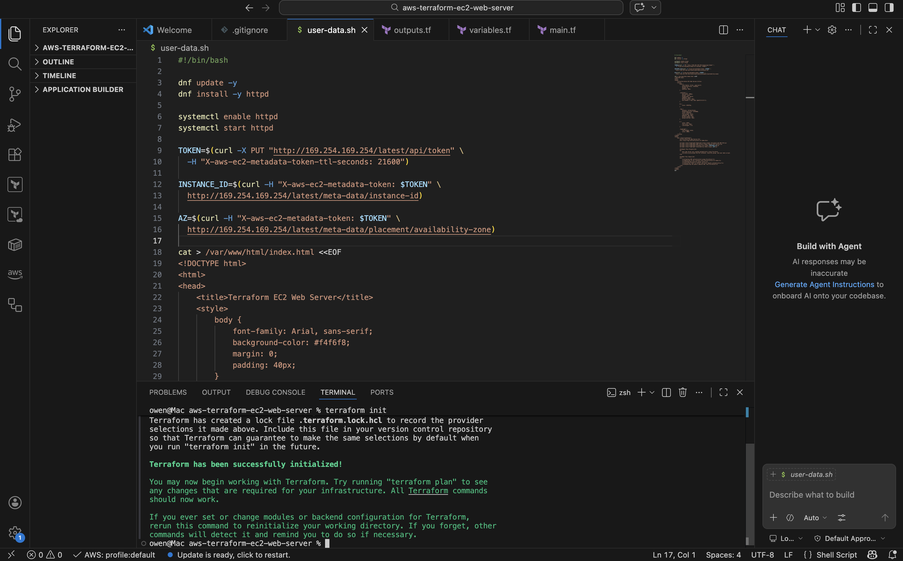
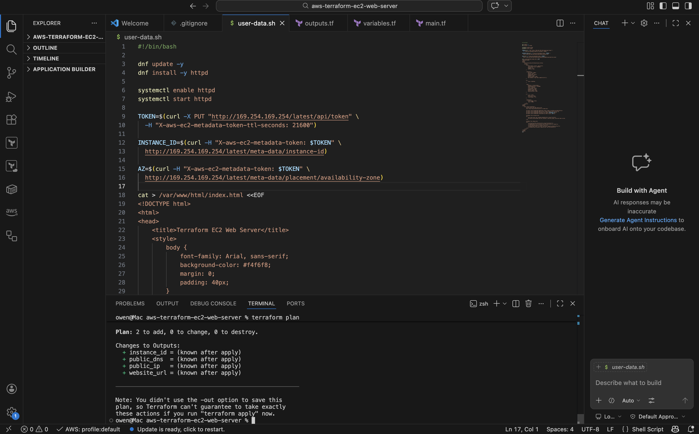
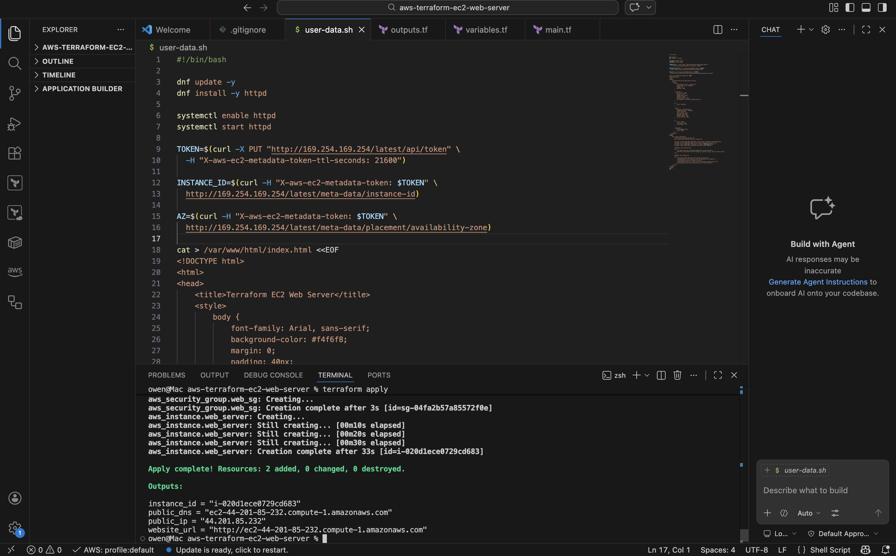
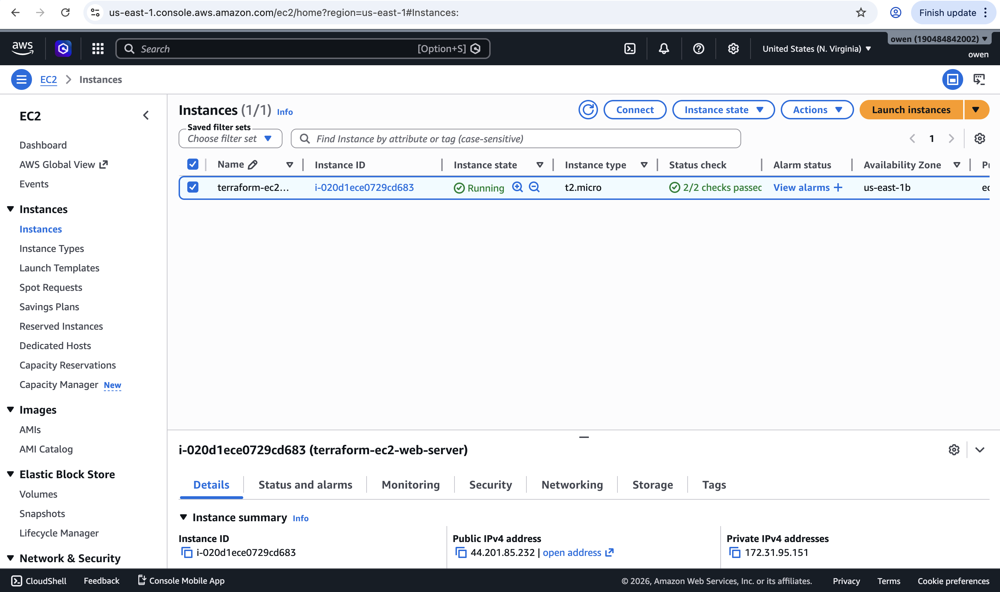
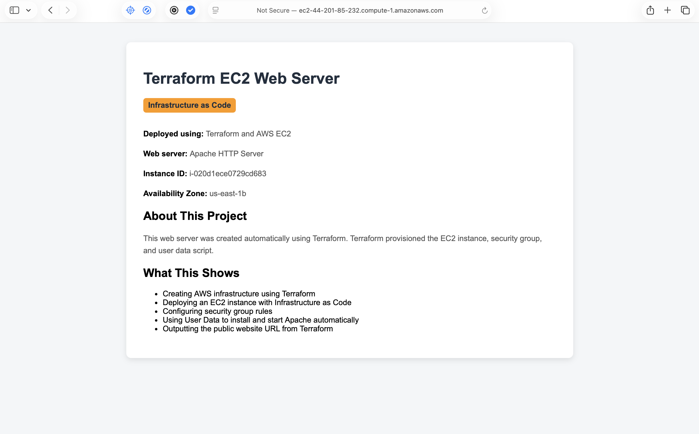
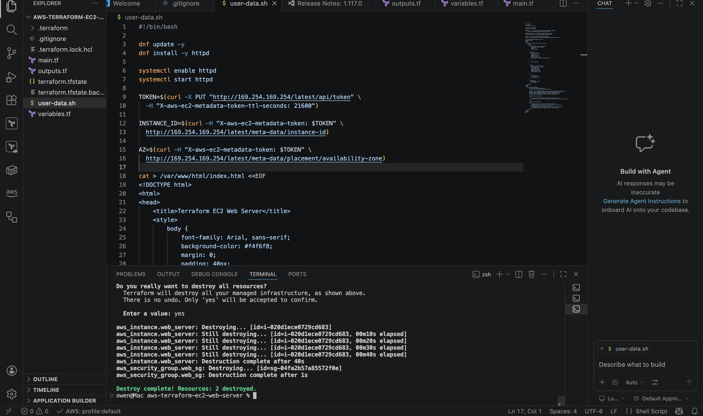
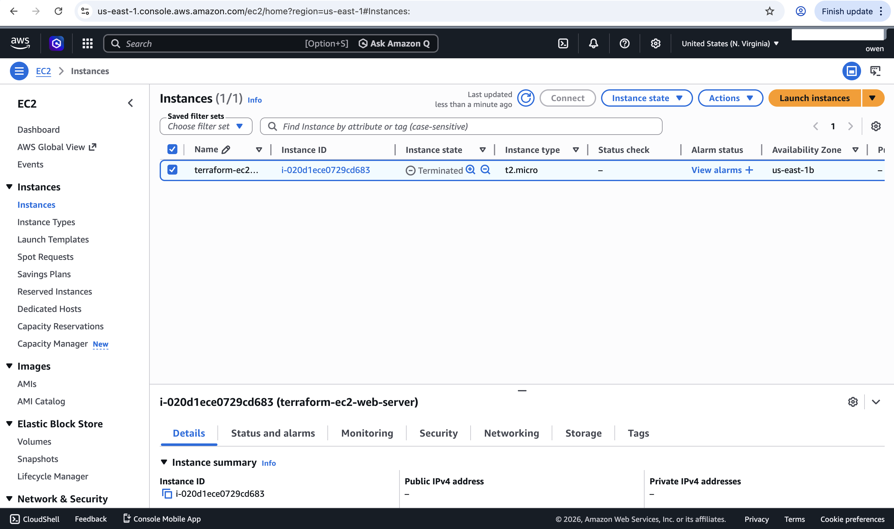

# AWS Terraform EC2 Web Server

> Infrastructure as Code project using Terraform to provision an AWS EC2 web server.

---

## Overview

This project demonstrates how to provision AWS infrastructure using Terraform.

I used Terraform to create an EC2 instance, configure a security group, and deploy an Apache web server automatically using a User Data script. The website displays instance metadata such as the EC2 Instance ID and Availability Zone.

After testing, I used `terraform destroy` to remove the AWS resources and avoid unnecessary charges.

---

## Architecture

- Terraform
- AWS EC2
- Security Group
- User Data
- Apache HTTP Server
- Amazon Linux 2023
- AWS CLI
- VS Code

---

## Features

- Infrastructure deployed using Terraform
- EC2 instance created automatically
- Security group configured for HTTP access
- Apache installed and started using User Data
- Dynamic webpage showing:
  - Instance ID
  - Availability Zone
- Terraform outputs the public website URL
- Infrastructure destroyed using Terraform cleanup

---

## How It Works

1. Terraform initializes the AWS provider.
2. Terraform reads the default VPC and subnet information.
3. A security group is created to allow HTTP traffic on port 80.
4. An EC2 instance is launched using Amazon Linux 2023.
5. A User Data script installs and starts Apache automatically.
6. The website is served from the EC2 instance.
7. Terraform outputs the public website URL.
8. `terraform destroy` removes all resources after testing.

---

## Terraform Commands Used

```bash
terraform fmt
terraform init
terraform plan
terraform apply
terraform destroy
```

---

## Screenshots

### Terraform Init



---

### Terraform Plan



---

### Terraform Apply



---

### EC2 Instance Running



---

### Website Working



---

### Terraform Destroy



---

### EC2 Instance Terminated After Destroy



---

## Project Files

- `main.tf` — main Terraform configuration
- `variables.tf` — input variables
- `outputs.tf` — Terraform outputs
- `user-data.sh` — EC2 startup script
- `.gitignore` — excludes local Terraform state/cache files
- `Screenshots/` — project evidence

---

## What I Learned

- How to use Terraform to deploy AWS infrastructure
- How Terraform providers work
- How to create EC2 instances with Infrastructure as Code
- How to configure AWS security groups using Terraform
- How to use User Data to automate server setup
- How to output useful resource information from Terraform
- Why Terraform state files should not be uploaded to GitHub
- How to clean up infrastructure using `terraform destroy`

---

## Why This Project Matters

This project demonstrates Infrastructure as Code, which is widely used in cloud engineering and DevOps roles.

Instead of manually creating infrastructure in the AWS console, Terraform allows cloud resources to be defined, version-controlled, reviewed, and recreated consistently.
